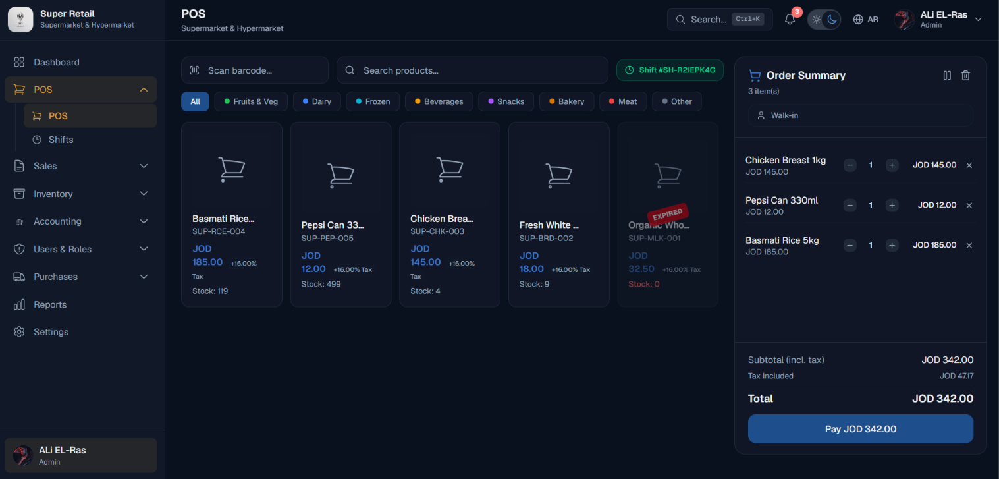
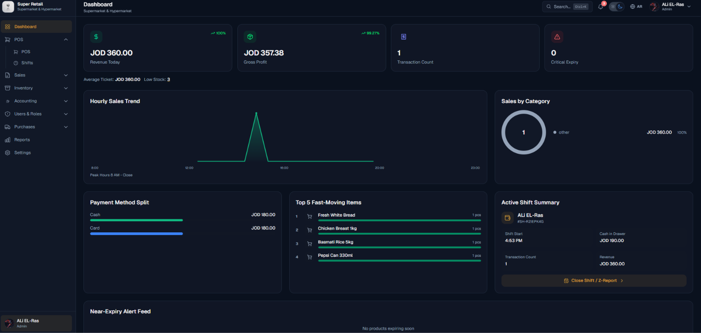
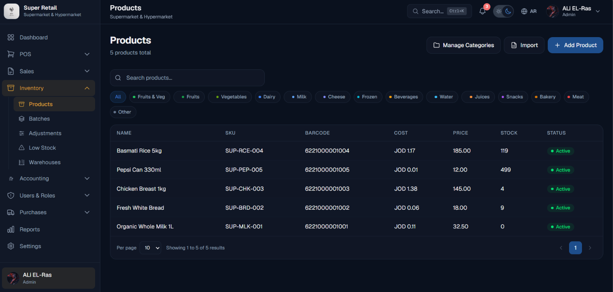
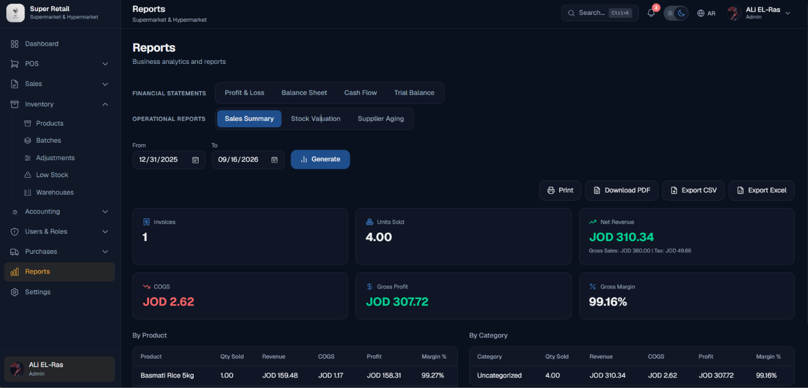

# SuperX ERP & POS Platform 🚀

[](https://laravel.com)
[](https://nextjs.org)
[](https://www.postgresql.org)
[](https://www.typescriptlang.org)
[](https://tailwindcss.com)

**SuperX ERP** is an integrated Enterprise Resource Planning (ERP) and Point of Sale (POS) system based on a Multi-Tenant Architecture, specifically designed to manage retail and wholesale operations, double-entry accounting, and precise inventory management with batch tracking (FEFO).

---

## 📸 Screenshots & Overview

| **Point of Sale (POS)** | **Financial Dashboard & GL** |
| :---: | :---: |
|  |  |
| *Fast POS interface and barcode scale reading* | *Dashboard and real-time financial reports* |

| **FEFO Inventory & Batches** | **System Reports** |
| :---: | :---: |
|  |  |
| *Batch tracking, expiry dates, and reconciliation* | *Comprehensive system and financial reports* |

---

## ✨ Key Features

### 🏢 Multi-Tenant & SaaS Engine
* **Isolation & Subdomains:** Full support for creating and assigning subdomains for each company (`subdomain.domain.com` / `localhost`).
* **Owner Administration:** Super-Admin dashboard to manage subscriptions, activate tenants, and automatically create isolated databases.

### 🛒 Retail & POS Operations
* **Scale Barcode Integration:** Parse electronic scale barcodes (EAN-13) to automatically extract weight and price.
* **Thermal Printing:** Support for thermal receipt printing (58mm / 80mm) with auto-assignment and billing customizations.
* **Negative Stock & Batch Controls:** Optional control to allow selling with negative stock, along with notifications and subsequent inventory reconciliation.
* **Shift Lifecycle:** Shift management, cash register closing, and direct discrepancy reconciliation (Shortage/Surplus).

### 📦 FEFO Inventory & Batch Tracking
* **First-Expired, First-Out (FEFO):** Automated issuance of the closest expiry batch to accurately lock Cost of Goods Sold (COGS).
* **Supplier Liability Claims:** Link waste and damage to supplier liability and automatically issue Debit Notes.
* **Expiry Alerts:** Dynamic alerts for products and vouchers nearing expiration based on customizable settings.

### 📊 Double-Entry Accounting Core
* **Automated Ledger Posts:** Automated journal entries for every sale, purchase, return, and shift closure.
* **Financial Reports:** Chart of Accounts, Trial Balance, Profit & Loss (P&L), Balance Sheet, and Cash Flow statements.
* **Opening Balances:** Dynamic calculation of opening balances based on real inventory and batch valuation.

### 🔐 Security & RBAC
* **Role-Based Access Control:** Detailed permissions matrix at the module and action levels (View, Create, Edit, Delete).
* **Hashed Tenant Auth:** Encrypted and independent authentication for tenant databases with device and shift isolation.

---

## 🛠️ Technology Stack

| Layer | Technology |
| :--- | :--- |
| **Backend Framework** | Laravel 11.x (PHP 8.2+) |
| **Frontend Framework** | Next.js 14 (App Router) / React 18 |
| **State & Styling** | Tailwind CSS, Lucide Icons, Shadcn UI Components |
| **Database** | PostgreSQL (Main & Tenant Dynamic Schemas) |
| **Internationalization** | RTL/LTR Full Support (Arabic & English) |
| **Authentication** | Laravel Sanctum / Token-Based Subdomain Auth |

---

## 🚀 Getting Started

### Prerequisites
* PHP >= 8.2
* Node.js >= 18.x
* PostgreSQL >= 14.x
* Composer >= 2.x

### Backend Setup

1. **Clone the repository:**
   ```bash
   git clone https://github.com/your-org/superx-erp.git
   cd superx-erp/backend
   ```

2. **Install dependencies:**
   ```bash
   composer install
   ```

3. **Configure Environment:**
   ```bash
   cp .env.example .env
   php artisan key:generate
   ```
   *Update the PostgreSQL database connection details in the `.env` file.*

4. **Run Migrations & Seeders:**
   ```bash
   php artisan migrate:fresh --seed
   ```

5. **Start Local Server:**
   ```bash
   php artisan serve
   ```

### Frontend Setup

1. **Navigate to frontend folder:**
   ```bash
   cd ../frontend
   ```

2. **Install NPM Packages:**
   ```bash
   npm install
   ```

3. **Run Development Server:**
   ```bash
   npm run dev
   ```
   *Open your browser to [http://localhost:3000](http://localhost:3000).*

---

## 📁 Project Structure

```text
├── backend/
│   ├── app/
│   │   ├── Http/Controllers/Api/V1/   # API Endpoints
│   │   ├── Models/                     # Eloquent Entities
│   │   └── Services/                   # Business & Accounting Logic
│   ├── config/                         # System & Feature Configuration
│   └── database/migrations/            # Schema Migrations
│
├── frontend/
│   ├── src/
│   │   ├── app/                        # Next.js App Router Pages
│   │   ├── components/                 # UI & Form Components
│   │   ├── lib/                        # Helpers, API Hooks & RBAC Rules
│   │   └── locales/                    # i18n Dictionaries (AR / EN)
│   └── public/                         # Static Assets
```

---

## 🧪 Running Tests

The system includes comprehensive coverage for structural and accounting tests:

```bash
# Backend Test Suite (PostgreSQL)
cd backend
php artisan config:clear
DB_CONNECTION=pgsql DB_DATABASE=superx_erp_test vendor/bin/phpunit
```

---

## 👨‍💻 Developer

Developed with ❤️ by **ALi EL-Ras**.

---

## 📄 License

All rights reserved © 2026. This project is licensed under the **MIT** License.
